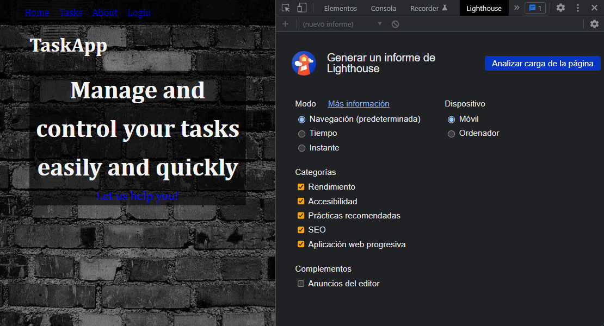
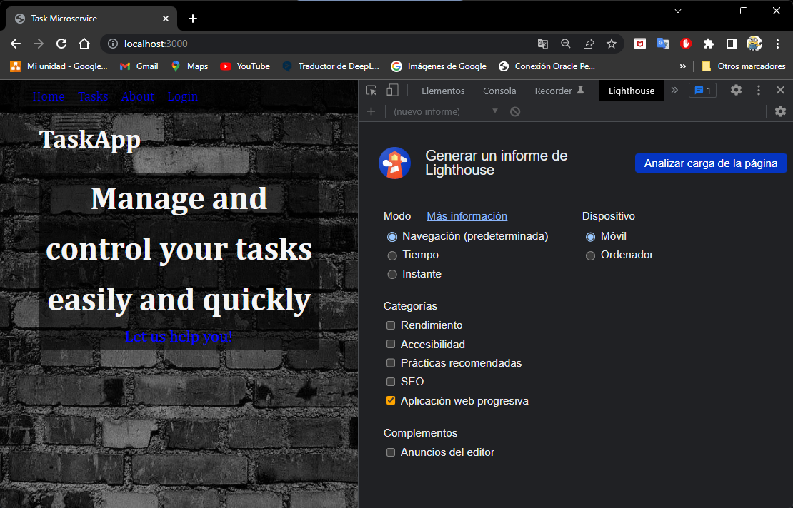
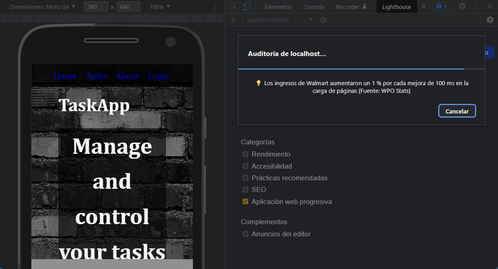
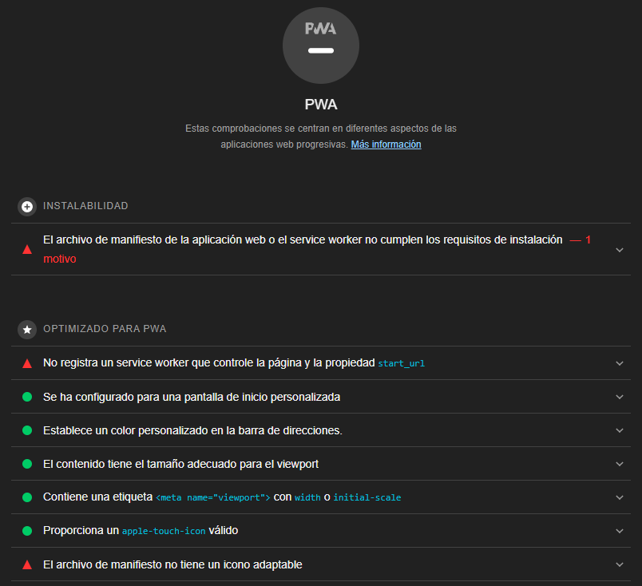
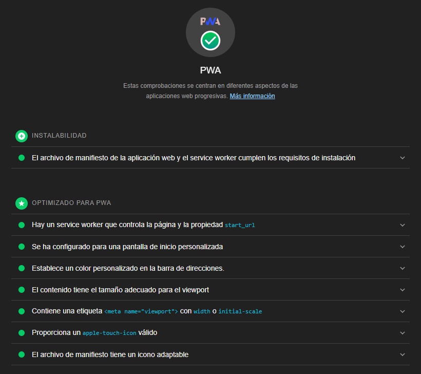

# Laboratorio 8: Stage Management / PWA

## Inovación y Emprendimiento con Tecnologías de Información

#### Camilo Andrés Pichimata Cárdenas

##### Octubre del 2022

## Desarrollo

Las implementaciones de este laboratorio se desarrollaron sobre una nueva rama creada en el laboratorio 6 llamada `Lab_8` a la que se puede acceder dando click [aqui](https://github.com/CamiloPichimata/IETI-Lab_6-Hooks-React_Router/tree/Lab_8)

### Parte 1: PWA

Comenzamos ejecutando la aplicación teniendo en cuenta que se cuenta con 3 servicios separados, uno para validar las credenciales ingresadas por el usuario que se encuentra utilizando la aplicación, otro para obtener el listado de tareas del ususario y finalmente, se ejecuta la aplicación de React con el comando `npm start` desde la capeta raiz de la aplicación.

Seguido a esto vamos a la dirección `http://localhost:3000/tasks` desde el navegador **Chrome** abrimos las herramientas de administrador y nos dirigimos a la pestaña **_Lighthouse_** donde podemos visualizar lo siguiente:



Dentro de **Categorías** seleccionamos unicamente la opción _Aplicación web progresiva_ y en **Dispositivo** seleccionamos la opción _Móvil_ como se ve a continuación:



Damos click en el botón `Analizar carga de la página` y esperamos...



Se obtuvo lo siguiente:



Como se puede ver, la aplicación no cumple los requisitos de instalación para ser una Aplicación Web Progresiva, para dar solución a esto debemos realizar las siguientes implementaciones y modificaciones:

- Se crea un nuevo archivo llamado **_worker.js_** dentro de la carpeta **_public_** con el siguiente contenido:

```javascript
/* eslint-disable no-restricted-globals */

var CACHE_NAME = "pwa-task-planner";
// Update this array to your defined routes
var urlsToCache = ["/"];

// Install a service worker
self.addEventListener("install", (event) => {
  // Perform install steps
  event.waitUntil(
    caches.open(CACHE_NAME).then(function (cache) {
      console.log("Opened cache");
      return cache.addAll(urlsToCache);
    })
  );
});

// Cache and return requests
self.addEventListener("fetch", (event) => {
  event.respondWith(
    caches.match(event.request).then(function (response) {
      // Cache hit - return response
      if (response) {
        return response;
      }
      return fetch(event.request);
    })
  );
});

// Update a service worker
self.addEventListener("activate", (event) => {
  var cacheWhitelist = ["pwa-task-planner"];
  event.waitUntil(
    caches.keys().then((cacheNames) => {
      return Promise.all(
        cacheNames.map((cacheName) => {
          if (cacheWhitelist.indexOf(cacheName) === -1) {
            return caches.delete(cacheName);
          }
        })
      );
    })
  );
});
```

- Se modifica el archivo **_index.html_** de la siguiente manera:

```html
<!DOCTYPE html>
<html lang="en">
  <head>
    <meta charset="utf-8" />
    <meta name="viewport" content="width=device-width, initial-scale=1" />
    <meta name="theme-color" content="#000000" />
    <meta
      name="description"
      content="Web site created using create-react-app"
    />
    <link rel="apple-touch-icon" href="%PUBLIC_URL%/logo192.png" />
    <!--
      manifest.json provides metadata used when your web app is installed on a
      user's mobile device or desktop. See https://developers.google.com/web/fundamentals/web-app-manifest/
    -->
    <link rel="manifest" href="%PUBLIC_URL%/manifest.json" />
    <!--
      Notice the use of %PUBLIC_URL% in the tags above.
      It will be replaced with the URL of the `public` folder during the build.
      Only files inside the `public` folder can be referenced from the HTML.
      Unlike "/favicon.ico" or "favicon.ico", "%PUBLIC_URL%/favicon.ico" will
      work correctly both with client-side routing and a non-root public URL.
      Learn how to configure a non-root public URL by running `npm run build`.
    -->
    <title>Task Microservice</title>
  </head>
  <body>
    <noscript>You need to enable JavaScript to run this app.</noscript>
    <div id="root"></div>
    <script>
      if ("serviceWorker" in navigator) {
        window.addEventListener("load", function () {
          navigator.serviceWorker
            .register("worker.js")
            .then(
              function (registration) {
                console.log(
                  "Worker registration successful",
                  registration.scope
                );
              },
              function (err) {
                console.log("Worker registration failed", err);
              }
            )
            .catch(function (err) {
              console.log(err);
            });
        });
      } else {
        console.log("Service Worker is not supported by browser.");
      }
    </script>
  </body>
</html>
```

Se crea un nuevo archivo dentro del directorio **_src_** llamado **_serviceWorkerRegistration.js_**

- Se actualiza el archivo **_src/index.js_** agregando la siguiente línea al final

```javascript
serviceWorker.register();
```

Seguido a eso se agrega el import necesario para el llamado de la función de la seiguiente manera:

```javascript
import * as serviceWorker from "./serviceWorkerRegistration";
```

- Agregamos la línea `"purpose": "any maskable"` en el archivo **_manifest.json_** con el fin de agregar la conpatibilidad con iconos enmascarables para el ícono de la aplicación:

```json
{
  "short_name": "React App",
  "name": "Create React App Sample",
  "icons": [
    {
      "src": "favicon.ico",
      "sizes": "64x64 32x32 24x24 16x16",
      "type": "image/x-icon",
      "purpose": "any maskable"   // (new line)
    },
    ...
  ],
  ...
}
```

Corremos de nuevo la aplicación, recargamos la página y ejecutamos _Lighthouse_ nuevamente para obtener un nuevo reporte en el que se obtiene lo siguiente:



Cómo se puede ver nuestra aplicación ahora cumple con todos los requisitos para ser una **Aplicación Web Progresiva**
